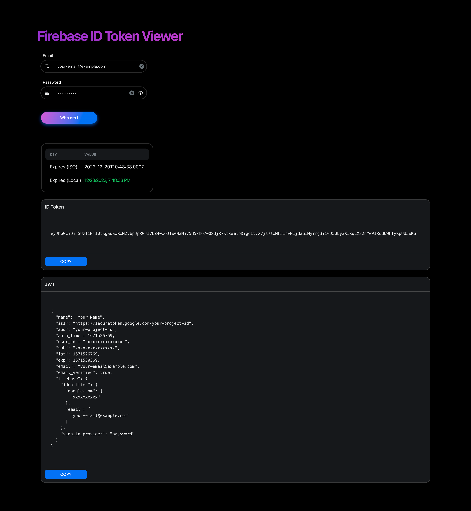
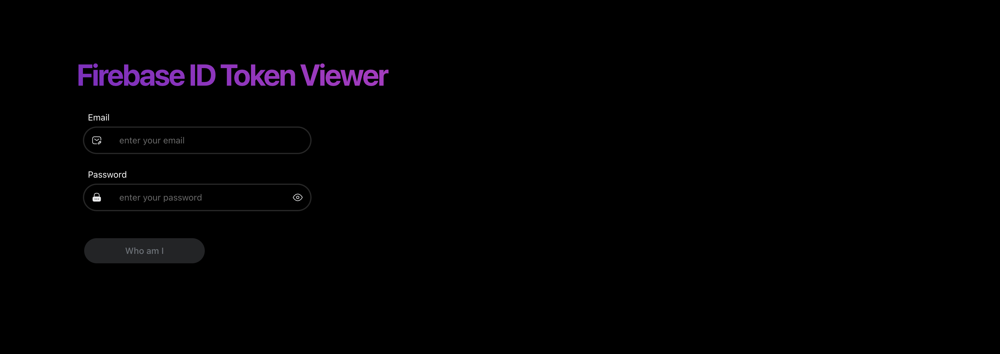
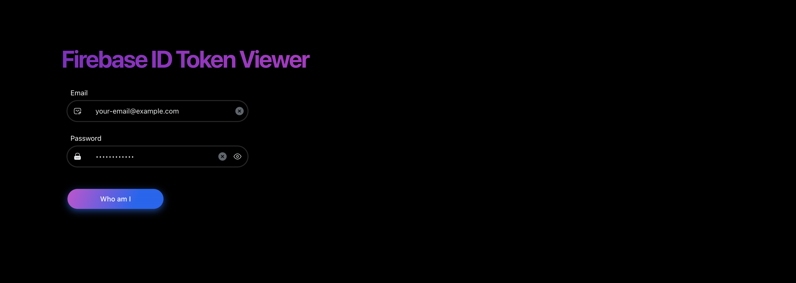
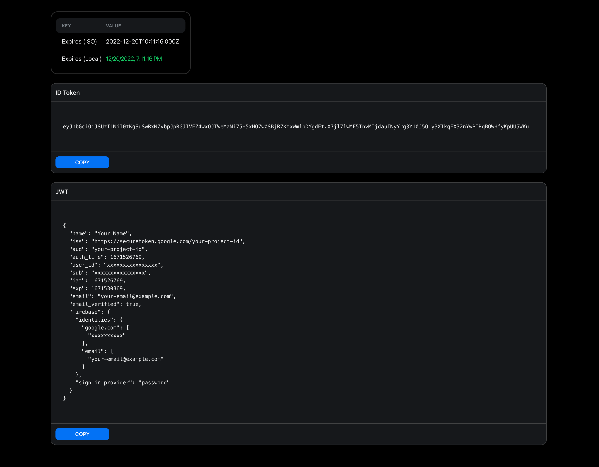

# Who am I - Firebase ID Token Viewer

* This application prints the tokens generated by Firebase Authentication in readable format.
* ID tokens are only decoded, not verified.
* Email or password you entered will never be sent to any outside network except Firebase.
* This is a developer tool. Do not use for your end users.



## Getting Started

### 1. Create a new .env.local file

```bash
cp .env.example .env.local
```

### 2. Set environments

```env
NEXT_PUBLIC_FIREBASE_API_KEY=
NEXT_PUBLIC_FIREBASE_AUTH_DOMAIN=
NEXT_PUBLIC_FIREBASE_DATABASE_URL=
NEXT_PUBLIC_FIREBASE_PROJECT_ID=
NEXT_PUBLIC_FIREBASE_STORAGE_BUCKET=
NEXT_PUBLIC_FIREBASE_MESSAGING_SENDER_ID=
NEXT_PUBLIC_FIREBASE_APP_ID=
```

* https://firebase.google.com/docs/web/setup

### 3. Run npm commands

```bash
npm i
npm run dev
```

### 4. Open your web browser localhost:3000



### 5. Enter your email and password



### 6. View details of a generated id token


